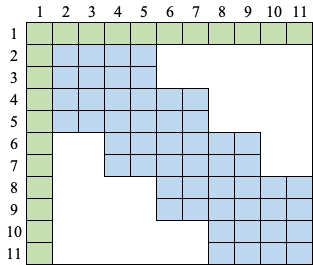
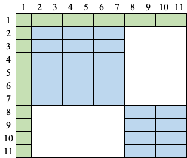

# FRITO: FREQUENCY-REGULARIZED TRANSFOR

This is the implementation for [Improving Domain Generalization for Sound Classification with Sparse Frequency-Regularized Transformer]()

We propose FRITO, an effective regularization technique on Transformer's self-attention, to improve the model's generalization ability by limiting each sequence position's attention receptive field along the frequency dimension on the spectrogram. Experiments show that our method helps Transformer models achieve SOTA generalization performance on TAU 2020 and Nsynth datasets while saving 20% inference time.

<p align="center"></p>

Our scheme includes local and global attention, similar to the efficient transformers. This method differs from previous work in that it restricts the receptive field along the frequency dimension, aiming to improve the model's generalization ability instead of dealing with long sequences.

      

# Setting up the experiments environment
This repo uses forked versions of sacred for configuration and logging, and pytorch-lightning for training.

For setting up [Mamba](https://github.com/mamba-org/mamba) is recommended and faster then `conda`:

```shell
conda install mamba -n base -c conda-forge
```
Now you can import the environment from `environment.yml`
```shell
mamba env create -f environment.yml
```
Now you have an environment named `ba3l`. Now install the forked versions of `sacred` and `pl-lightning` and `ba3l`.
```shell
# dependencies
conda activate ba3l
pip install -e 'git+https://github.com/kkoutini/ba3l@v0.0.2#egg=ba3l'
pip install -e 'git+https://github.com/kkoutini/pytorch-lightning@v0.0.1#egg=pytorch-lightning'
pip install -e 'git+https://github.com/kkoutini/sacred@v0.0.1#egg=sacred' 
```

# Getting started 
Each dataset has an experiment file such as `ex_dcase20.py` and `ex_nsynth.py` and a dataset folder with a readme file.
In general, you can prob the experiment file for help:
```shell
python ex_dcase20.py help
```

you can override any of the configuration using the [sacred syntax](https://sacred.readthedocs.io/en/stable/command_line.html).
In order to see the available options either use [omniboard](https://github.com/vivekratnavel/omniboard) or use:
```shell
 python ex_dcase20.py print_config
 ```
There are many pre-defined configuration options in `config_updates.py`. These include different models, setups etc...
You can list these configurations with: 
```shell
python ex_dcase20.py print_named_configs
```
There are many things that can be updated from the command line.
In short:
 - All the configuration options under `trainer` are pytorch lightning trainer [api](https://pytorch-lightning.readthedocs.io/en/1.4.1/common/trainer.html#trainer-class-api). For example, to turn off cuda benchmarking add `trainer.benchmark=False` to the command line. 
 - `models.net` are the FRITO (or the chosen NN) options.
 - `models.mel` are the preprocessing options (mel spectrograms).

# Training on dcase20
Download and prepare the dataset as explained in the [TAU2020](https://dcase.community/challenge2020/index).
The base FRITO model can be trained using:
```shell
python ex_dcase20_dev.py with models.net.rf_norm_t=row_overlap_8 use_mixup=True mixup_alpha=0.3 trainer.use_tensorboard_logger=True -p --debug
```
where `models.net.rf_norm_t` can be set to `row_overlap_{v}` or `per_row_{r}`, which corresponds to the overlap factor $v$ and row cluster size $r$ in the paper, respectively.

Multi-gpu training can be enabled by setting the environment variable `DDP`, for example with 2 gpus:

```shell
DDP=2 CUDA_VISIBLE_DEVICES=0,1 python ex_dcase20.py with models.net.rf_norm_t=high_low_branch trainer.use_tensorboard_logger=True -p --debug
```

# Training on nsynth
Download and prepare the dataset as explained in the [nsynth]([https://dcase.community/challenge2020/index](https://magenta.tensorflow.org/datasets/nsynth)).
The base FRITO model can be trained using:

```shell
python ex_nsynth.py with models.net.rf_norm_t=high_low trainer.use_tensorboard_logger=True -p --debug
```

which is equivalent to:

```shell
python ex_nsynth.py with models.net.rf_norm_t=per_row_6 trainer.use_tensorboard_logger=True -p --debug
```

where `models.net.rf_norm_t` can be set to `row_overlap_{v}` or `per_row_{r}`, which corresponds to overlap factor $v$ and row cluster size $r$ in the paper, respectively.

# Sparse Attention
Specifically, we implement `models.net.rf_norm_t=sparse_row_{r}` as the sparse version of `models.net.rf_norm_t=per_row_{r}`.
```shell
python ex_nsynth.py with models.net.rf_norm_t=sparse_row_6 trainer.use_tensorboard_logger=True -p --debug
```

# Contact
The repo will be updated, in the mean time if you have any questions or problems feel free to open an issue on GitHub, or contact the authors directly.
